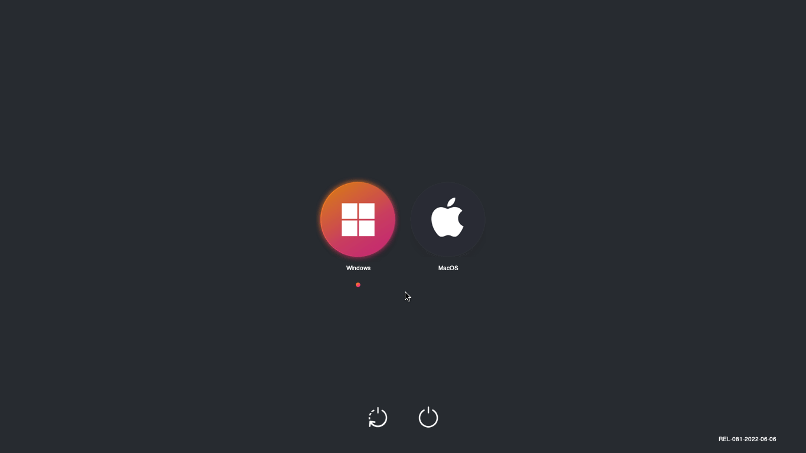
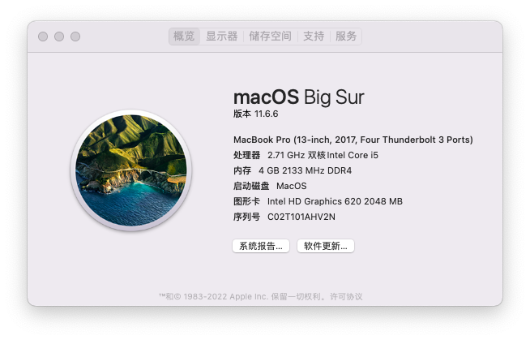
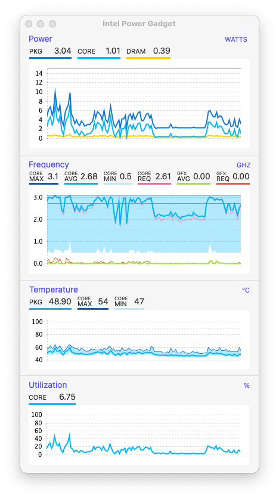
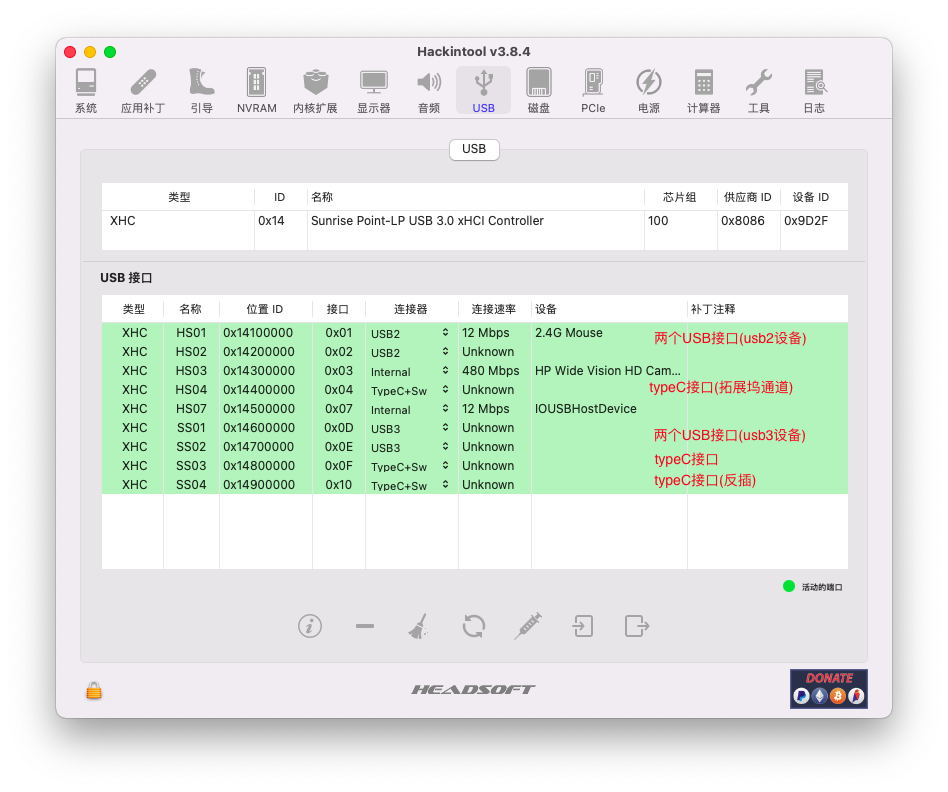
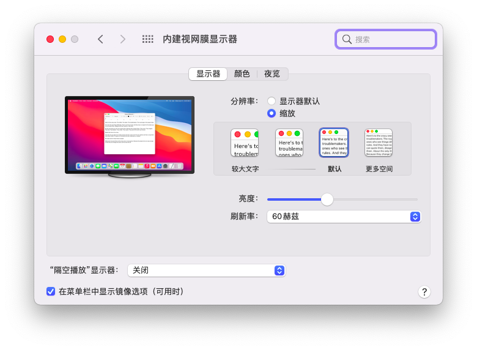
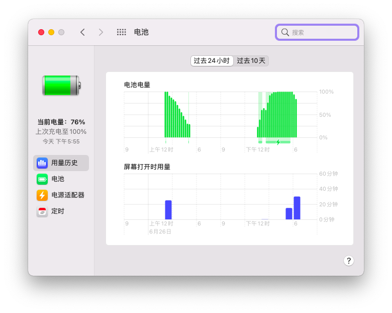

引导版本 Open Core 8.1

## 1. 配置

| 硬件     | 配置                                               |
| -------- | -------------------------------------------------- |
| 处理器   | 英特尔酷睿i5-7200U @ 2.5GHz双核                    |
| 主板     | 惠普 8368                                          |
| 内存     | 三星 DDR4 2400 MHz                                 |
| 硬盘     | 铠侠-EXCERIA TC10 256G (sata)                      |
| 核显     | UHD 620                                            |
| 独显     | Nvidia GeForce 940MX                               |
| 显示器   | 京东方 BOE06A4 (15.5英寸)                          |
| 声卡     | 瑞昱 @英特尔 High Definition Audio控制器           |
| 有线网卡 | 瑞昱 RTL8168/8111/8112 Gigabit Ethernet Controller |
| 无线网卡 | 英特尔 Dual Band Wireless-AC 3168                  |

## 2. 正常

- 核显、网卡、蓝牙

- 声卡、内置麦克风
- 声音、亮度调节
- 电池电量显示

## 3. 不正常

- 独立显卡：无法驱动
- 睡眠唤醒：只能通过电源键唤醒
- 隔空投送：需要更换无线网卡

## 4. 其他展示

### 引导界面

### 基本信息

### CPU频率

### USB定制

### HiDPI支持

### 电池电量

